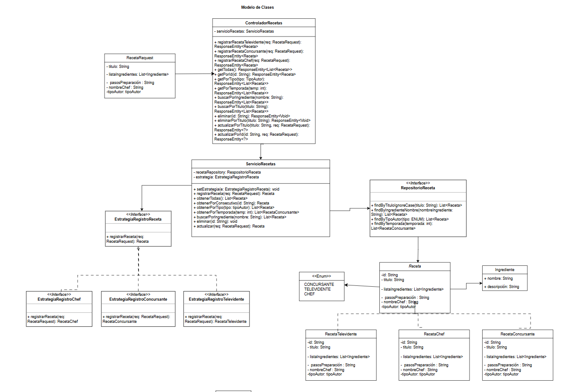

# MASTER CHEF CELEBRITY

## Descripción general
Este proyecto es una aplicación desarrollada basada en master chef celebrity en **Java** con **Spring Boot** que permite registrar, consultar, actualizar y eliminar recetas de distintos tipos de usuarios:
- **Televidentes**
- **Participantes**
- **Chefs**

---

## Tecnologías utilizadas
- **Java 17+**
- **Spring Boot**
- **Spring Web**
- **Spring Data JPA**
- **Maven**
- **IntelliJ IDEA**
- **Azure**

---

## Estructura del proyecto

____
## Diseño
___
## **Diagrama de casos de uso**
A continuación se muestran los casos de uso para los actores identificados, se muestra de forma general
que los actores pueden hacer las mismas acciones como lo son eliminar, consultar y registrar o actualizar una receta.

## Diagrama de clases

El siguiente diagrama representa las clases del sistema, en el cual se usa el patrón Strategy
para el registro de recetas según el tipo de usuario y manejando una arquitectura Controller -> Service -> repository.

Las clases principales son:
* **ControladorReceta**: gestiona las solicitudes externas desde una API y devuelve las respuestas mediante ResponseEntity.

* **ServicioReceta**:Contiene la lógica de negocio del sistema., teniendo conexión a un RepositorioReceta (acceso a datos) y a una EstrategiaRegistroReceta,
implementando los metodos CRUD.

* **RepositorioReceta (interfaz):** permite buscar recetas por título, ingrediente o tipo, obtener las más populares, y actualizar la información.

* **EstrategiaRegistroReceta (interfaz):** Define el método registrarReceta, que las subclases concretas implementan de acuerdo al tipo de usuario. Las
estrategias específicas son:EstrategiaRegistroChef ,EstrategiaRegistroConcursante  Y EstrategiaRegistroTelevidente.

* **Receta**: clase base con atributos comunes: título, listaIngredientes, pasosPreparacion y nombreChef.

## Diagrama bases de datos NOSQL

A continuación se muestra el diagrama de la base de datos NOSQL, el documento recetas es el contenedor prinicpal
en donde se incluyen todos los campos, aplicando una estructura embebida se guardan los ingredientes como una lista de objetos, los cuales
tienen sus propios campos (nombre, descripción). Se tienen campos opcionales como lo es la temporada ya que esta solo se
guarda si la receta es de un concursante.

## Diagramas de secuencia

###  **Registrar recetas**
Con base en la estrategia
específica de cada actor se construye una Entidad (RecetaTelevidente, RecetaConcursante, RecetaJurado), se guarda vía 
repositorio en la base de datos y se devuelve la información.

* **Receta Televidente**

* **Receta Concursante**

* **Receta Jurado**

### **Obtener Recetas**
Se tienen varios métodos de consulta de recetas:

* **obtener todas las recetas**
Se hace uso de una función findAll() en la colección de recetas y se devuelve la lista de estas.

* **Obtener receta por su ID**

Se hace la búsqueda del id dentro de la colección de recetas, en caso de encontrarla se devuelve la información
de esta receta.

* Obtener receta por tipo (concursante, televidente, jurado) 
Se hace un filtro por el tipo de Receta en la base de datos.

* **Obtener Receta por Temporada**
Al darse una temporada, se buscan todos los registros guardados que coincidan en el campo de la temporada y son devueltos.

* **Obtener Receta por ingrediente**
Se realiza una consulta sobre la lista de ingredientes de cada una de las recetas presentes en la base de datos.

### Eliminar una receta !!!
* **Eliminar receta por ID**
Se elimina una receta con su identificador (id) en caso de existir.

### Actualizar una receta
Si la receta existe, se hace la actualización de los campos especificados por el actor.

## Instrucciones de instalación y ejecución

### Ejemplos de solicitudes y respuestas

### Swagger UI

### Uso de Docker para conectar BD mongo
docker run -d --name masterchef-mongo -p 27017:27017 -v mongo_data:/data/db -e MONGO_INITDB_DATABASE=masterchef mongo:7.0
